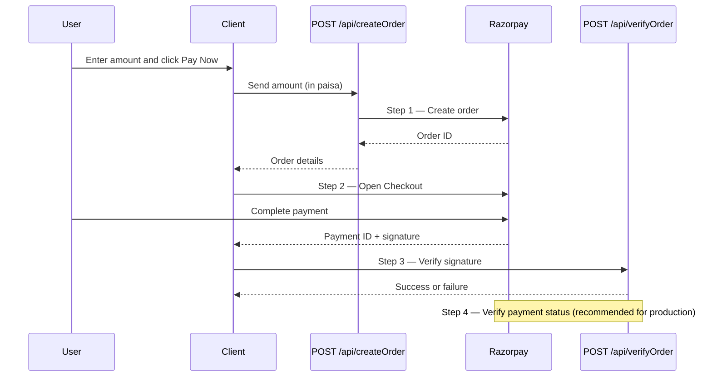

# Next.js Razorpay Integration

A minimal [Next.js](https://nextjs.org) app that demonstrates how to accept payments with [Razorpay](https://razorpay.com) using the standard order → checkout → signature verification flow.

## Features

- Create Razorpay orders from a server-side API route
- Open Razorpay Checkout from the client
- Verify payment signatures on the server before treating a payment as successful
- Simple payment UI with amount input and loading state

## Tech stack

- Next.js 16 (App Router)
- React 19
- TypeScript
- Tailwind CSS 4
- [Razorpay Node SDK](https://www.npmjs.com/package/razorpay)

## Prerequisites

- Node.js 20+
- A Razorpay account ([sign up](https://dashboard.razorpay.com/signup))
- API keys from the [Razorpay Dashboard](https://dashboard.razorpay.com/app/keys) (use **Test Mode** while developing)

## Getting started

1. Clone the repository and install dependencies:

```bash
npm install
```

2. Create a `.env` file in the project root:

```env
NEXT_PUBLIC_RAZORPAY_API_KEY=your_razorpay_key_id
RAZORPAY_SECRET=your_razorpay_key_secret
```

| Variable | Description |
| --- | --- |
| `NEXT_PUBLIC_RAZORPAY_API_KEY` | Razorpay Key ID (public, used on the client and server) |
| `RAZORPAY_SECRET` | Razorpay Key Secret (server-only — never expose this in client code) |

3. Start the development server:

```bash
npm run dev
```

4. Open [http://localhost:3000](http://localhost:3000), enter an amount in INR, and click **Pay Now**.

Use Razorpay [test cards and UPI IDs](https://razorpay.com/docs/payments/payments/test-card-upi-details/) to simulate payments in test mode.

## Integration process

Razorpay requires these steps on both the **server** and the **frontend**:

| Step | Where | What to do | In this project |
| --- | --- | --- | --- |
| 1 | Server | Create an order using the [Orders API](https://razorpay.com/docs/api/orders/) | `POST /api/createOrder` — `src/app/api/createOrder/route.ts` |
| 2 | Frontend | Add Razorpay Checkout and pass the order ID to checkout | `src/component/Payment.tsx` + checkout script in `src/app/page.tsx` |
| 3 | Server | Verify the payment signature | `POST /api/verifyOrder` — `src/app/api/verifyOrder/route.ts` |
| 4 | Server | Verify the payment status | Not implemented yet — use the [Payments API](https://razorpay.com/docs/api/payments/) or [webhooks](https://razorpay.com/docs/webhooks/) in production |

### Step-by-step

1. **Create an order (server)** — When the user clicks Pay, the client sends the amount to your server. The server calls Razorpay's Orders API and returns an `order_id`.

2. **Open Razorpay Checkout (frontend)** — Load the Razorpay checkout script, initialize checkout with your Key ID and the `order_id`, then call `payment.open()`.

3. **Verify payment signature (server)** — After checkout succeeds, Razorpay returns `razorpay_payment_id`, `razorpay_order_id`, and `razorpay_signature`. Send these to your server and verify the signature with your key secret before marking the payment as successful.

4. **Verify payment status (server)** — Confirm the payment is actually captured/settled by fetching the payment or order from Razorpay, or by handling webhook events. Signature verification alone does not replace this check in production.

## Payment flow



1. The client sends the amount (converted to paisa) to `/api/createOrder`.
2. The server creates a Razorpay order and returns the order ID.
3. The Razorpay Checkout modal opens on the client.
4. After a successful payment, Razorpay calls the client `handler` with payment details.
5. The client sends those details to `/api/verifyOrder`, which validates the HMAC signature using your key secret.
6. On success, you can update your database or redirect the user (currently shown as an alert).
7. In production, add step 4 — verify payment status via the Razorpay API or webhooks before fulfilling the order.

## Project structure

```
src/
├── app/
│   ├── api/
│   │   ├── createOrder/route.ts   # Creates a Razorpay order
│   │   └── verifyOrder/route.ts   # Verifies payment signature
│   ├── page.tsx                   # Loads Razorpay script and payment UI
│   └── layout.tsx
└── component/
    └── Payment.tsx                # Payment form and checkout logic
```

## Scripts

| Command | Description |
| --- | --- |
| `npm run dev` | Start the development server |
| `npm run build` | Create a production build |
| `npm run start` | Run the production server |
| `npm run lint` | Run Biome checks |
| `npm run format` | Format code with Biome |

## Going to production

- Switch to **Live Mode** keys in the Razorpay Dashboard and update your environment variables.
- Replace the success `alert` in `Payment.tsx` with a redirect or order confirmation page.
- Persist order and payment status in your database inside `/api/verifyOrder`.
- Consider adding [Razorpay webhooks](https://razorpay.com/docs/webhooks/) for reliable server-side payment notifications.

## References

- [Razorpay Node.js integration guide](https://razorpay.com/docs/payments/server-integration/nodejs/integration-steps/)
- [Razorpay Checkout documentation](https://razorpay.com/docs/payments/payment-gateway/web-integration/standard/integration-steps/)
- [Payment signature verification](https://razorpay.com/docs/payments/payment-gateway/web-integration/standard/integration-steps/#step-3-verify-payment-signature)
